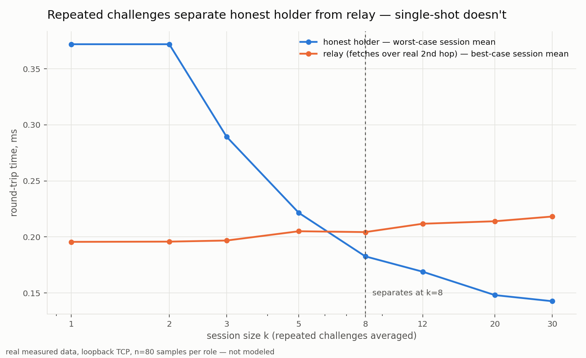

# Censorship-resistant video platform — PoC notes

Brainstormed in #all-pdx 2026-08-22: a YouTube replacement indexed on Bitcoin,
distributed over BitTorrent-style magnet links. This tracks what got built and
what was actually learned, not just the idea.

## The core design problem

Storage and delivery over BitTorrent-plus-a-chain-timestamp is the easy part —
solved plumbing. The two things that actually kill projects like this:

- **Incentives.** LBRY minted a token and got sued as an unregistered security.
  BitTube minted a token and died to the standard watch-to-earn Ponzi spiral.
  PeerTube minted nothing and stayed permanently niche — no incentive layer at
  all, purely volunteer-hosted. Anchoring to *existing* BTC (no new token) and
  paying for service directly over Lightning avoids both failure modes at once.
- **Discovery.** A single global index or "most popular" list is exactly as
  seizable as YouTube's own trending page. The answer that doesn't reintroduce
  a chokepoint: no canonical list at all — gossiped signals (payments, in this
  case), any number of independent, replaceable indexer apps computing their
  own view, Nostr-style. Not built yet, just designed.

## What's built

### `poc_challenge_auction.py` — possession-gated reverse auction

`merkle_root`/`merkle_proof`/`verify_proof` are vendored byte-for-byte from
[rwscarb/btcvm](https://github.com/rwscarb/btcvm)'s `ott.py` — the same
functions `ott verify-chunk` runs locally, copied in rather than imported so
this repo has no dependency outside itself. `btcvm` (source, including
`ott`) is also [published on PyPI](https://pypi.org/project/btcvm/) now —
`pip install btcvm` — if you want the real CLI rather than just these three
vendored functions.

In-process simulation, five peers, one 8-chunk file.

**Part 1 — chunk-index challenge + auction.** A naive price-only auction picks
the cheapest bidder regardless of whether they can deliver — and does, in the
run captured here (a peer holding zero chunks wins on price alone). Gating bid
eligibility on passing a random chunk-index + Merkle-proof challenge fixes it:
a peer with nothing gets caught every round; a peer that tampers its response
~70% of the time gets caught most rounds and wins once by pure luck — real
evidence that a single spot-check isn't airtight, only a statistical one is.
A legitimately partial holder (only half the chunks) correctly sits out
rounds for chunks it doesn't have, without being flagged dishonest.

**Part 2 — nonce-salted challenge + timing bound.** Knowing a file's public
SHA256 gives an attacker nothing — SHA256 preimage resistance means you can't
derive `hash(chunk||nonce)` from `hash(chunk)` alone, so a peer with only the
published hash can't even attempt a response. A peer that *does* have the
real bytes but fetches them from someone else in real time (relaying) answers
with a cryptographically **correct** hash every time — the nonce alone can't
catch that. Only an added timing bound can, because the relay hop costs real
latency a local holder never pays.

### `poc_network_challenge.py` — the same mechanism over real sockets

Takes the timing-bound claim off paper: real TCP, real OS subprocesses, real
`time.perf_counter()`, loopback (127.0.0.1). Three modes:

- `holder <port>` — actually stores chunks, answers directly
- `relay <port> <holder_host> <holder_port>` — stores nothing, chains a
  second real TCP connection to the holder to fetch real bytes before
  answering
- `verify-remote <h_host> <h_port> <r_host> <r_port> [b_host] [b_port]` —
  client mode: connects to already-running holder/relay (e.g. other
  containers) and runs the separation analysis against them, with an
  optional second honest holder as a same-vs-same jitter baseline
- (no args) — local convenience: single-shot challenge rounds on loopback, narrated
- `stats` — local convenience: spawns holder+relay as subprocesses on
  loopback, bulk collection (80 real samples per role) + bootstrap analysis
  of how many repeated challenges it takes for the *session mean* to
  reliably separate holder from relay

**Real finding, not the expected one:** on loopback, single-shot timing does
*not* reliably separate a holder from a relay — the honest holder's worst
recorded round was slower than the relay's best. Averaging repeated
challenges does separate them (typically somewhere in the k=3–20 range across
several runs — see below); trust a session average, not any one round.

RunPod was down the first time this was tried, so real WAN latency got
measured against public hosts as a substitute (1.1.1.1, 8.8.8.8,
api.github.com: 5-30ms real TCP-connect RTT) — suggestive, not conclusive.
**Update: ran it for real once a RunPod box came back up**, tunneled over a
real SSH connection (`ssh -L`, since the pod only exposes its SSH port, not
arbitrary TCP) — local honest holder vs. a local relay that secretly fetches
from that real remote box for every challenge:

```
holder: mean 0.254ms  min 0.186ms  max 1.250ms
relay:  mean 432.648ms  min 395.583ms  max 638.218ms

session size k   worst honest mean   best cheater mean  separated?
             1             1.250ms           395.583ms  YES
```

~1700x gap, separates cleanly at k=1 — single-shot is all you need once real
geographic distance is involved. Confirms the substitute-host hypothesis:
real WAN distance makes this *easy*; the hard case this PoC actually
stress-tests is two peers that are genuinely close together, which is
exactly when a nearby relay is hardest to catch on timing
alone.



Chart from `viz_challenge_separation.py` — regenerates real measurements each
run rather than plotting a fixed snapshot. **The exact crossover k is not a
fixed constant** — it moved between k=3, k=8, and k=20 across different runs
of this same script on the same machine, purely from real system jitter. That
instability is itself the finding: don't hardcode a specific k, measure it
live and adapt, and prefer statistical separation over any fixed threshold.

### `docker-compose.yml` — the same test over real container networking

Four services: `holder1` and `holder2` (two independent honest peers),
`relay` (holds nothing, relays from `holder1` over the compose network),
`verifier` (runs the same repeated-challenge analysis against all three,
using DNS service names instead of loopback).

```bash
docker compose up --build --abort-on-container-exit verifier
```

Real run, over podman's docker-compose shim, actual separate containers on
the compose bridge network:

```
holder: mean 0.246ms  min 0.188ms  max 0.953ms
relay:  mean 0.483ms  min 0.414ms  max 1.134ms
holder2 (2nd honest holder, same-vs-same jitter baseline): mean 0.236ms  min 0.209ms  max 0.311ms

session size k   worst honest mean   best cheater mean  separated?
             1             0.953ms             0.414ms  no
             2             0.626ms             0.414ms  no
             3             0.712ms             0.421ms  no
             5             0.541ms             0.432ms  no
             8             0.430ms             0.437ms  YES
            12             0.425ms             0.445ms  YES
            20             0.346ms             0.448ms  YES
            30             0.314ms             0.451ms  YES
```

Same shape as loopback (single-shot doesn't separate, k≈8 does), plus one
useful sanity check the loopback version can't give: holder2's baseline mean
(0.236ms) sits right next to holder1's (0.246ms) — two equally honest,
unrelated containers naturally land close together, while the relay
(0.483ms, roughly double) is a real structural gap, not just inter-container
noise.

### `poc_reputation.py` — persistent local reputation + signed portable attestations

Two mechanisms, both real (Ed25519 via the `cryptography` package, actual
signing and verification, not simulated):

1. **Local reputation store** (`ReputationStore`, persisted to JSON) — a
   client's own record of direct experience with a peer (passes/fails/avg
   latency), so a known-good peer doesn't need to re-earn trust from zero on
   every interaction.
2. **Signed attestations** — a client signs its own verification outcome for
   a peer and hands the signed blob to another client, who didn't do the
   verification but can check the signature and decide how much to trust it.
   Same shape as PGP's Web of Trust, applied to possession-verification
   outcomes instead of key identity — including PGP's actual historical
   weak point: the crypto is the easy part, "how much do I trust this
   signer" is the unsolved UX problem, not a technical one.
3. **Revocation** — a signer can kill their own earlier vouch (`sign_revocation`,
   keyed to the attestation's content-hash `attestation_id`). Only accepted
   if the revocation's signer matches the original attestation's signer;
   the revoked attestation stays on record rather than being deleted, so
   "X vouched for Y, then revoked it" stays an honest, auditable fact
   instead of quietly disappearing.

Demonstrated for real in one run: a fresh client with zero direct history
bootstraps a trust score for an unknown peer purely from another client's
signed vouch; a vouch from a signer you don't trust at all is cryptographically
valid but contributes zero weight; mutating a signed payload after the fact
(`passes: 8 → 800`) is caught by signature verification; a 90-day-old
attestation is worth 0.125x a fresh one under a 30-day trust half-life;
alice revoking her own vouch drops bob's trust score for that peer without
bob ever re-verifying it himself; mallory forging a revocation of *alice's*
vouch (valid signature, wrong signer) is correctly rejected; a revocation
referencing an attestation nobody's ever seen is rejected too.

### `lightning_settle.py` + `lightning/` — real Lightning HTLC settlement

Replaces `poc_challenge_auction.py`'s mock "settlement" print with a real
one: two real LND nodes (Lightning Labs' production node software) on
regtest, real bitcoind backing them, a real funded channel between them.
`poc_challenge_auction.py --lightning` settles every auction round's winner
with a genuine BOLT11 invoice + HTLC — not simulated, and not just trusting
LND's own "SUCCEEDED" status: `lightning_settle.py` independently re-hashes
the revealed preimage and checks it against the invoice's payment_hash
locally before calling it settled.

Real run, 5 winning rounds, real preimages each verified against their own
payment hash:

```
WINNER: bob      9 sat   preimage 4ac71143706b...  payment_hash d1be1130c553...
WINNER: bob      5 sat   preimage eea88d802d1a...  payment_hash 8acabea4ddf7...
WINNER: bob      6 sat   preimage 76f1ade0f9be...  payment_hash f9c9bda28be0...
WINNER: bob     10 sat   preimage 96e696c1cde9...  payment_hash f8eeb66d1878...
WINNER: mallory  1 sat   preimage 508385841cb3...  payment_hash 1c2872b6018f...
```

Bob's cumulative channel balance after the run matched the sum of every
settled payment exactly, checked directly against LND rather than assumed.
Full setup steps in `lightning/README.md` — real bitcoind + LND takes a
one-time channel-funding setup regtest can't skip (mine to coinbase
maturity, open a channel, mine confirmations) before it's usable.

### `poc_real_archive_challenge.py` — real `.ott` archive, real video, real scale

Every other PoC file here used `os.urandom` fake chunks (8 of them).
This one points the same mechanism at a real 217MB video, archived with the
real `ott` CLI at a real 64KB chunk size:

```
real archive: real_video.mp4, 217,831,234 bytes, 3324 real chunks x 65536 bytes
recomputed Merkle root matches ott's own commit: True
```

The thing this was actually checking — proof size at real scale:

```
chunk     0: 12 steps, 396B raw, 1176B as JSON
chunk  1662: 12 steps, 396B raw, 1168B as JSON
chunk  3323: 12 steps, 396B raw, 1167B as JSON
```

12 proof steps at 3324 real chunks vs. 3 steps at the toy 8-chunk scale —
exactly log2(N), not linear, confirmed with real numbers instead of just
trusting the math. Even a 2-hour movie at these settings (~10GB, ~163,840
64KB chunks) would only need ~17 steps, still under 1KB. Then ran the same
nonce-salted-challenge logic from `poc_challenge_auction.py` Part 2 against
real bytes read straight off disk at real offsets — all 5 real rounds
checked out: hash matches ott's own committed leaf, Merkle proof verifies,
nonce response is internally consistent.

`real_archive/real_video.mp4` isn't committed to this repo (208MB, and it's
not this repo's to redistribute) — `real_archive/.ott/`'s metadata is
tracked, so the chunk list and commitment are there for inspection even
without the video itself. Reproduce with any file:

```bash
cd real_archive
python3 /path/to/btcvm/ott.py init
# edit .ott/config, set "chunk_size" to whatever you want (65536 used here)
python3 /path/to/btcvm/ott.py add your_video.mp4
python3 /path/to/btcvm/ott.py commit
cd ..
python3 poc_real_archive_challenge.py
```

### `discovery_relay.py` + `poc_discovery.py` — discovery, no canonical index

The last unsolved piece from the original brainstorm, actually built: no
single "trending" list, no server whose seizure kills discoverability.
Three independent relay processes (`discovery_relay.py` — real stdlib
`http.server`, no deps), each deliberately dumb: verifies a posted event's
signature (a relay won't store garbage) but has zero opinion on content
quality, zero ranking logic. A creator (carol) publishes a real event
pointing at the real video's real Merkle root from item 6. Viewers like it
and subscribe to each other, spread across the three relays — nobody posts
to all three, on purpose.

Two clients, `bob` (subscribes to dan + erin) and `mallory` (subscribes to
frank only), each query all three relays, verify every event's signature
themselves (never trust a relay's word for it), and compute their own
ranking from their own subscribe graph — subscriptions *are* the trust
graph, not a separate feature, same insight from the Slack thread now
actually running as code:

```
same 27 gossiped events, both clients saw all 23 likes (3 honest + 20 sybil),
but scored the content differently — 2.0 (bob) vs 1.0 (mallory) — because
ranking runs on each client's own trust graph, not vote count.
```

A 20-identity sybil swarm likes the same content — every signature is
real and individually valid, a relay has no basis to reject any of them —
and moves neither client's score, because neither bob nor mallory
subscribes to any of the sybils. Sybil resistance from the trust graph,
not from relay-side moderation.

Then relay:9101 — the one carol's publish event and dan's like both
happened to live on — gets killed outright. Real result, not a clean win:
the content stays discoverable and rankable (erin's like survived on a
different relay), but the human-readable title and dan's like are gone for
good, since neither was posted anywhere else. Redundancy has to be
deliberate — post to more than one relay — it isn't automatic just because
relays are plural. Same limitation a real Nostr relay dying would have.

```bash
python3 poc_discovery.py
```

## Running it

`./dura.py --help` (or `dura.py lightning --help` for the nested ones) is
the friendliest entry point — it's a thin argparse wrapper over the
Makefile, same targets, real subcommands and `--help` text instead of
needing to remember `make` target names. `make help` lists the same
targets directly. Or run any command below on its own:

```bash
python3 poc_challenge_auction.py          # in-process, Parts 1 + 2, narrated
python3 poc_network_challenge.py          # real sockets, single-shot rounds, loopback
python3 poc_network_challenge.py stats    # real sockets, repeated-challenge separation, loopback
python3 poc_reputation.py                 # real Ed25519 signing/verification demo
python3 viz_challenge_separation.py       # regenerates the chart above from fresh data
docker compose up --build --abort-on-container-exit verifier   # same test, real containers
cd lightning && docker compose up -d && cd ..   # real bitcoind + 2 LND nodes (see lightning/README.md for setup)
python3 poc_challenge_auction.py --lightning    # same auction, real HTLC settlement
python3 poc_real_archive_challenge.py           # same challenge mechanism, real 3324-chunk video
python3 poc_discovery.py                        # 3 real relays, personalized ranking, sybil test
```

Self-contained — no dependency outside this repo. Needs `cryptography` and
`matplotlib` (`pip install cryptography matplotlib`) for the reputation demo
and the chart; `poc_network_challenge.py` and `poc_challenge_auction.py` are
pure stdlib on their own. Docker/Compose needed for the container-network
test and for `--lightning` (real bitcoind + LND, see `lightning/README.md`).

## Next steps

1. ~~Nonce-salted challenge + timing bound~~ — done, `poc_challenge_auction.py` Part 2
2. ~~Real network round-trip instead of in-process~~ — done, `poc_network_challenge.py`
3. ~~Local reputation + signed portable attestations~~ — done, `poc_reputation.py`
4. ~~Real WAN calibration against an actual second machine~~ — done, real
   RunPod box over an SSH tunnel: ~1700x gap, separates at k=1
5. ~~Real Lightning HTLC settlement~~ — done, `lightning_settle.py` +
   `lightning/` (real bitcoind + 2 LND nodes, real BOLT11 invoices, real
   preimage reveal independently re-verified). Regtest, not public testnet —
   same reasoning as #4: real protocol code, skip the wait on chain
   sync/faucets.
6. ~~Point the mechanism at a real `.ott` archive~~ — done,
   `poc_real_archive_challenge.py`: real 217MB video, 3324 real chunks,
   12-step proofs (~400B), confirmed O(log N) not linear.
7. ~~Attestation revocation~~ — done, `poc_reputation.py`: signer-only
   revocation keyed to `attestation_id`, forged revocation from a different
   signer correctly rejected, revoked attestation kept on record not deleted.
8. ~~Discovery layer~~ — done, `discovery_relay.py` + `poc_discovery.py`:
   3 independent dumb relays, personalized client-side ranking from each
   client's own subscribe graph, sybil-resistant (20 fake identities move
   neither client's score), real relay-death test (content survives,
   anything posted only to the dead relay doesn't — redundancy isn't free).

Every item on the original roadmap is now built and verified against real
output, not just designed. What's left is scaling and hardening this, not
proving the mechanisms work — see each section above for the honest edges
(loopback timing separation isn't airtight without averaging, relay death
loses non-redundant data, RunPod flakiness, etc.) that are still real
constraints even though the core ideas held up.
